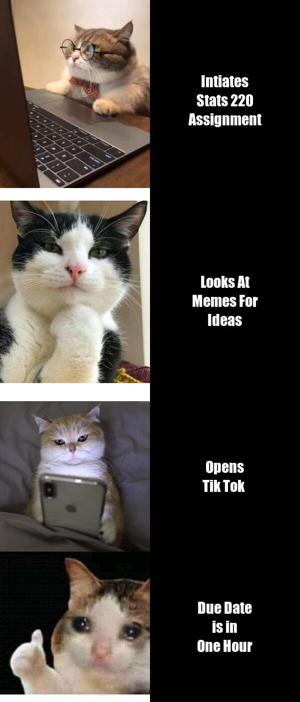

# Yahallo Everyone

Welcome To My Stats 220 Repo! 

## About me

I am a Second Year University Of Auckland student studing a Bachelors of Computer Science and Statistics.
I Love Anime, Games and Memes.

## MEMES!!!!!!!!!!.
I Love browsing memes in my spare time therefore decided to make on of my very own.
Below is a meme I made using the R package [{magick}](https://cran.r-project.org/web/packages/magick/vignettes/intro.html).

A really short and unhelpful summary of my inspiration for the meme is:

1. I was browsing for meme Ideas and i came across a this particular meme which i found quite funny.
2. I took inspiration from this Meme and decide to make my very own.

I also probably should provide the `R` code I used to make the meme!
